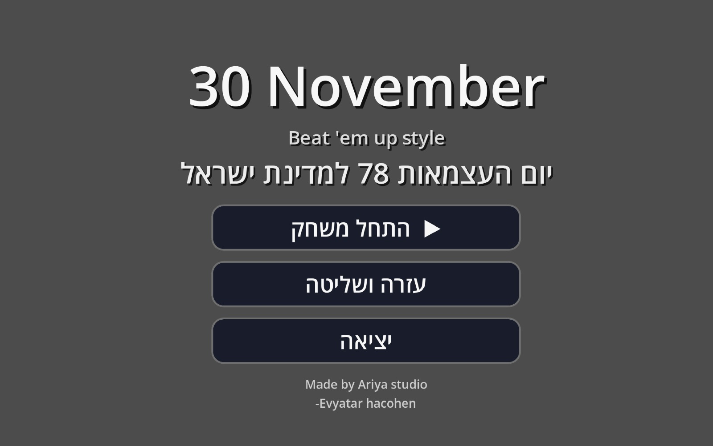
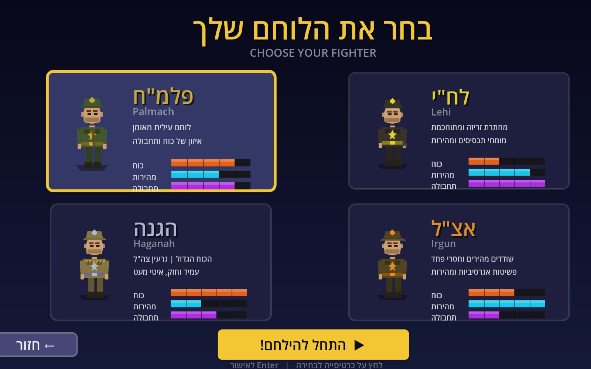
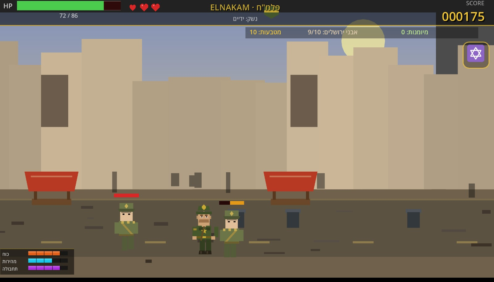
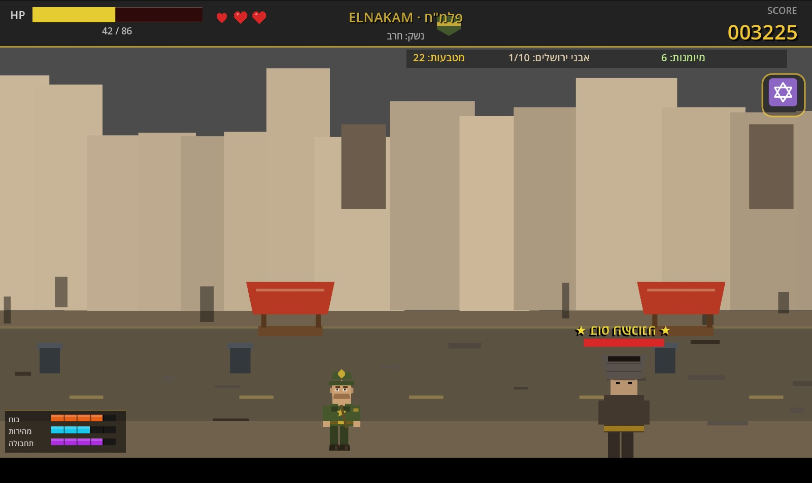

# Independence Day Beat 'Em Up — 30 November

> A retro arcade beat 'em up set during the Israeli War of Independence (1948), built with **Godot 4.3**.

Inspired by classics like *Streets of Rage*, *Final Fight*, and **Little Fighter 2** — fast side-scrolling action with historically-styled pixel art characters.

---

## Screenshots

<table>
  <tr>
    <td></td>
    <td></td>
  </tr>
  <tr>
    <td align="center"><em>Main Menu</em></td>
    <td align="center"><em>Choose Your Fighter</em></td>
  </tr>
  <tr>
    <td></td>
    <td></td>
  </tr>
  <tr>
    <td align="center"><em>Street Combat — Jerusalem 1948</em></td>
    <td align="center"><em>Boss Encounter</em></td>
  </tr>
</table>

---

## Intro Cinematic

The game ships with a **gaming / comic-style intro video** generated from gameplay screenshots.  
Style: Little Fighter 2 — fast cuts, impact sparks, speed lines, slam text, dramatic boss reveal.

**Scenes:**
1. `1948` — black screen, glitching gold title
2. Night cityscape — *"Jerusalem. 1948."*
3. Character roster — each fighter drops in with stat bars
4. Combat x3 — FIGHT / POW / COMBO cuts with hit sparks + impact rings
5. Shop / upgrade flash
6. Boss reveal — red grade, pulsing WARNING bar, expanding HP bar
7. Title card — `30 NOVEMBER` slam + Press Start blink

### Generate the video yourself

```bash
# Requires Python 3.x
pip install moviepy pillow numpy python-bidi imageio

python make_intro.py
# Output: intro_30nov.mp4  (~21 seconds, 1280x720, 30fps)
```

> The script reads screenshots from `תמונות לוידאו/` and exports `intro_30nov.mp4`.  
> The MP4 is excluded from git (`.gitignore`) — run the script to regenerate it.

---

## Gameplay

- Choose from four fighters: **Palmach, Lehi, Haganah, Irgun**
- Side-scrolling waves across the streets of 1948 Jerusalem
- Combo attacks, pickups, HP system with lives
- Shop between waves — upgrade Sword / HP / Jerusalem Stones
- Boss encounters with HP bars
- Touch controls for mobile + keyboard for desktop

## Characters

| Fighter | Organization | Strength | Speed | Skill |
|---------|-------------|----------|-------|-------|
| Palmach | Pre-state IDF elite | ████░ | ███░░ | ████░ |
| Lehi | Underground resistance | ███░░ | █████ | █████ |
| Haganah | Jewish defense force | █████ | ███░░ | ███░░ |
| Irgun | National military org. | ███░░ | █████ | ██░░░ |

## Platforms

| Platform | Status |
|----------|--------|
| Web / HTML5 | Playable in browser |
| Android | Godot export |
| iOS | Godot export |

## Tech Stack

- **Engine:** Godot 4.3 (GDScript)
- **Art:** Procedural pixel art drawn in code
- **Monetization:** AdMob (mobile) / AdSense (web) — rewarded video ads
- **Intro video:** Python + Pillow + imageio (`make_intro.py`)

## Project Structure

```
scenes/              MainMenu, CharacterSelect, Game, GameOver, NameEntry
scripts/             Game logic, Player, Enemy, HUD, TouchControls, AdsManager
assets/              Backgrounds, flag graphics, audio/video, screenshots
make_intro.py        Generates the intro cinematic from game screenshots
```

## Running the Project

1. Install [Godot 4.3](https://godotengine.org/download/)
2. Open `project.godot`
3. Press **F5** to run

## Historical Context

Set during the 1948 Israeli War of Independence — the period when Israel declared statehood and fought for its survival. Characters are inspired by the real underground organizations that became the foundation of the IDF.

---

*Built for Israeli Independence Day (יום העצמאות) — a historical arcade tribute.*  
*Made by Ariya Studio · Evyatar Hacohen*
